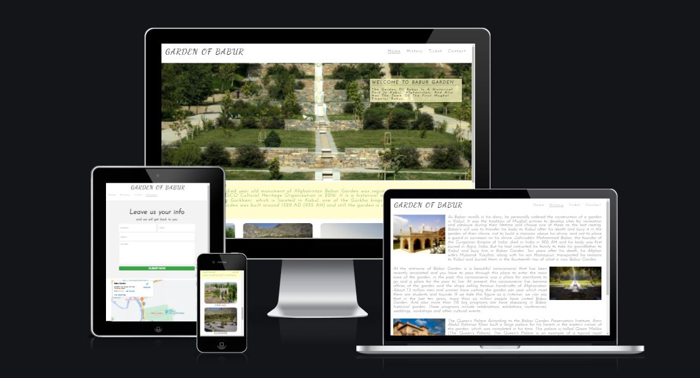
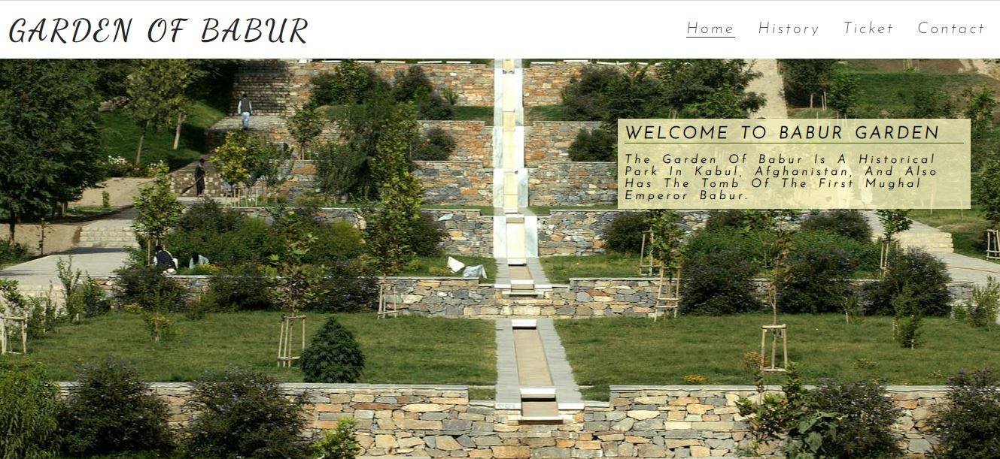
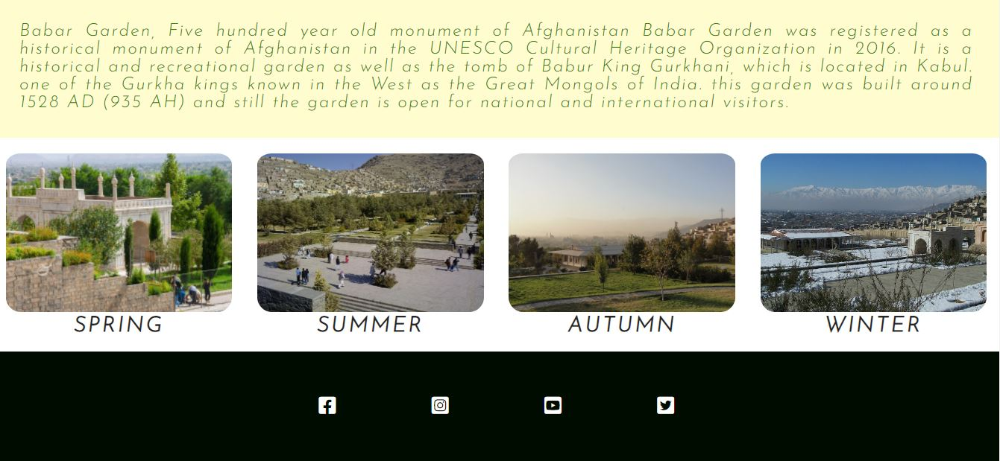
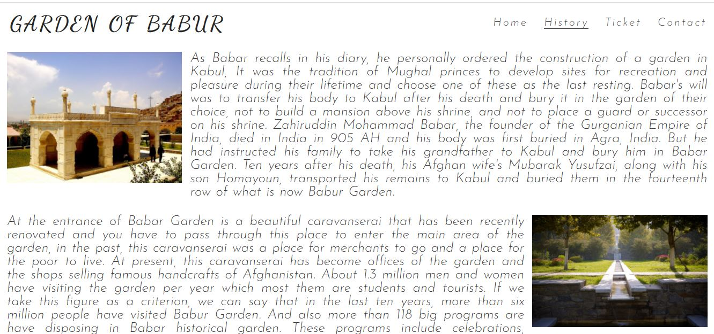
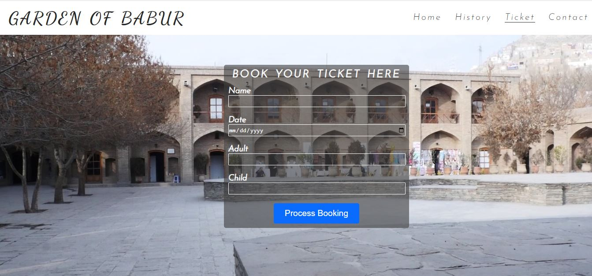
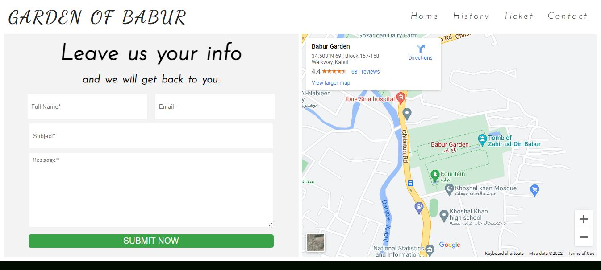

# GARDEN OF BABUR

#### [Garden of Babur](https://sadafsafi22.github.io/garden_of_babur/index.html)

Babur garden is an historical and recreational garden which is located in Kabul Afghanistan, this park has hundred years old memorial this site hope is to give a short introduction of the garden for tourists and other national visitors who want to visit this place, and help them to easily book their tickets and don’t face with any problem during their visit from this garden. 

## Existing Features

* 	Navigation Bar
     -	Nav bar includes in all four pages of the project, which includes the Home page, History page, Ticket booking page, and Contact page, it’s the same for all pages to allow users easily navigate. 
     - 	This feature help users to easily across over their desire pages.
*   The Main Image
    - This section display an Image which is an overview to the Babur garden park, also within the image it has a short welcome message for the users.

* Home Page Paragraph
    - This section has a paragraph about the Babur garden and giving a short information regarding the park for users.
* Different seasons of Babur Garden
    - This section includes four images, each of them shows Babur garden views in different season of the year, and help users to imagine the park in the season they want to visit.
* The Footer 
    - This section includes four links to Babur Garden relevant social media sites, these links are for Babur garden Facebook, Instagram, YouTube and Twitter, which allow users to easily Navigate and open these sites in new tab.

* History Page
    - This section help users to read about the Babur garden and find some fantastic information for this garden that help them during their visit time, so this section has three paragraph, first paragraph is about the Babur who build the Park, second paragraph is general information about the visitors of the park and type of ceremonies which are celebrating there, and third paragraph is about Queen’s Palace which located within the garden.

* Ticket Page
    - This section has a form which help visitors to book their ticket online this feature help them to specify their visit time from the garden, safe their time which they don’t go to the garden in close time and enjoy their visit and it also help, This section will be updated as these times change to keep the user up to date.

* Contact Page
    - This section has two part first contact and second is map.
    - Contact section help users to ask any question or give feedback before or after visiting the park, The user will be asked to submit their full name and email address, subject and message.
    - The last section which is the map shows the location of the park and help user to easily reach there.

* Responsive on all device sizes
    - We use @media query on CSS to design our website to be responsive for all devices with different width;

## Future features
    
* We design a page to allow users to add their images and memories.

## Technologies

* Languages Used
    - HTML5
    - CSS3

* IDE & Libraries Used
    - **Gitpot:** gitpot is used to arrange and help to write clean code.
    - **Git:** is used for variety control to apply the Gitpod terminal to Git commit and push the GitHub.
    - **GitHub:** is used to collect codes of the project after the project codes are pushed from Git.
    - **Google:** Fonts: We used from google font in style.css file of the project, this file is used for font style in all pages of the project.
    - **Font Awesome:** We used Font Awesome to add social media icons in the footer of all pages of the project.

## Testing
* HTML 
    - All codes are validate and there were no errors when we check through the [W3C HTML Validator](https://validator.w3.org/)
        * [Home](https://validator.w3.org/nu/?doc=https%3A%2F%2Fsadafsafi22.github.io%2Fgarden_of_babur%2Findex.html)
        * [History](https://validator.w3.org/nu/?doc=https%3A%2F%2Fsadafsafi22.github.io%2Fgarden_of_babur%2Fhistory.html)
        * [Ticket](https://validator.w3.org/nu/?doc=https%3A%2F%2Fsadafsafi22.github.io%2Fgarden_of_babur%2Fticket.html)
        * [Contact](https://validator.w3.org/nu/?doc=https%3A%2F%2Fsadafsafi22.github.io%2Fgarden_of_babur%2Fcontact.html)
* CSS 
    - All codes are validate and there were no errors when we check through the [W3C CSS Validator](https://jigsaw.w3.org/css-validator/)
        * [Style CSS](https://jigsaw.w3.org/css-validator/validator?uri=https%3A%2F%2Fsadafsafi22.github.io%2Fgarden_of_babur%2Fticket.html&profile=css3svg&usermedium=all&warning=1&vextwarning=&lang=en)

## Testing User Experience Design (UXD)
We are care for our site visitors because, therefor we create a website which is:
* After entering the site, users are welcoming and automatically see a clear and simple home page which includes the navigation bar to easily go in their favorite page each link is describe the page main name or purpose, and also they can see a clear image of the place to avoid any misunderstanding.
* On History page we provide a short information for users to have a idea before visiting.
* Ticket page its also help users to book their ticket by filling a very simple form.
* Contact, we also provide another form for users to ask question and provide their feedback for us.

All the mentioned points are done to achieve positive user experience and our site be usable, enjoyable and easy to use for the users.

## Additional Testing 
* The site was tested by Google Chorme, Safari browser and Microsoft Edge.
* The site was observed on different devices like computer, iPad and mobile browsers.
* We asked some of our friends and family to check the site and ensure that all pages are display correctly.

## Unfixed Bugs

We solved all the bugs which report to us by mentor and friends from slack community.

## Design
* Color arrangement, mostly the color is used from within the display images to have a good color arrangement for the website.
* Font family, Dancing script, Cursive and Josefin sans (Dancing script is used for logo, and for body Cursive and Josefin sans is used).

## Deployment

this site is deployed to github pages. With these flowing steps 
* 	In the GitHub repository, navigate to the setting tab
* 	In the side bar menu select Pages
* 	On the source from dropdown menu select main
* 	Lastly press save button
*   After saved the page is reloaded and site is published 

Your site is published at https://sadafsafi22.github.io/garden_of_babur/

## Credits
* Content 
    - The Project home page Content text written by Developer.
    - The text of history page were from Wikipedia.
    - Icons for the footer were taken from [Font Awesome](https://fontawesome.com/)
* Media 
    - The photos/ images which are used to this website are from Open source site.

## Acknowledgements
* My Mentor for constant useful comment.
* My Husband for support and useful feadback.
